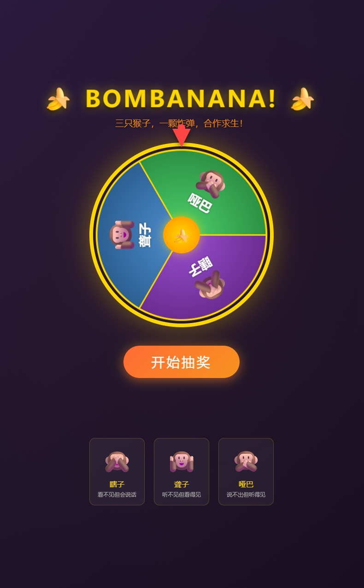
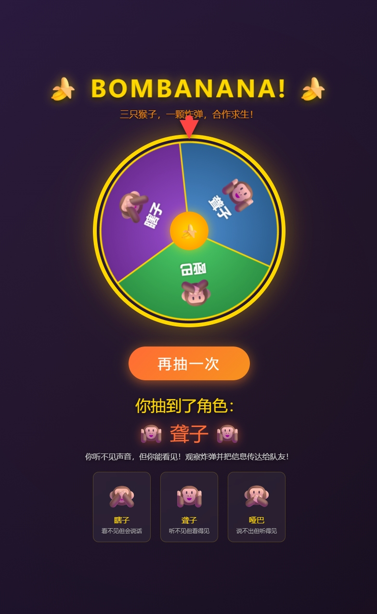

# 🍌 BOMBANANA! Character Wheel

一个为 **BOMBANANA!** 游戏设计的角色抽取转盘工具。三只猴子，一颗炸弹，合作求生！

> [🇨🇳 简体中文](#中文说明) | [🇬🇧 English](#english)

---

## 中文说明

### 🎮 关于 BOMBANANA!

BOMBANANA! 是一款合作拆弹游戏。三只猴子各有不同的感官缺陷，必须通过团队协作来拆除炸弹：

| 角色 | 特点 | 能力 |
|------|------|------|
| 🙈 **瞎子** | 看不见（黑屏+白轮廓） | 能说能听，接收聋子语音指令执行拆弹 |
| 🙉 **聋子** | 听不见 | 能说能看见，观察炸弹告知哑巴，看手势后语音指挥瞎子 |
| 🙊 **哑巴** | 说不出话 | 能看能听，听描述查手册，用手势告知聋子拆弹方法 |

### 🎰 转盘功能

- 随机抽取一个角色供玩家游玩
- 炫酷的转盘旋转动画
- 粒子特效庆祝
- **支持中英文切换 (CN/EN)**
- 纯前端实现，无需服务器

### 📸 效果预览

#### 转盘主界面

#### 抽奖结果

### 🚀 在线体验

👉 [点击体验 BOMBANANA! 角色转盘](https://tapkeen.github.io/BOMBANANA-CharacterWheel/)

### 🛠️ 技术实现

- 纯 HTML5 + CSS3 + JavaScript
- Canvas 绘制转盘
- CSS3 动画与粒子特效
- 响应式设计，支持移动端

### 📋 使用方法

1. 打开 [在线链接](https://tapkeen.github.io/BOMBANANA-CharacterWheel/)
2. 点击右上角 **CN / EN** 切换语言
3. 点击 **「开始抽奖」** 按钮
4. 等待转盘停下，查看抽到的角色
5. 点击 **「再抽一次」** 可重新抽取

---

## English

### 🎮 About BOMBANANA!

BOMBANANA! is a cooperative bomb-defusal game. Three monkeys each have a different sensory impairment and must work together to defuse the bomb:

| Character | Impairment | Ability |
|-----------|-----------|----------|
| 🙈 **The Blind** | Cannot see (black screen + white outline) | Can speak & hear; follows the Deaf's verbal instructions to defuse |
| 🙉 **The Deaf** | Cannot hear | Can speak & see; observes bomb, informs Mute, reads gestures, then verbally guides the Blind |
| 🙊 **The Mute** | Cannot speak | Can see & hear; listens to the Deaf, checks manual, uses gestures to inform the Deaf |

### 🎰 Wheel Features

- Randomly select a character for each player
- Spinning wheel animation with easing
- Particle burst celebration effect
- **Chinese / English language switch (CN/EN)**
- Pure frontend — no server required

### 📸 Preview

#### Wheel Main Interface

#### Spin Result

### 🚀 Live Demo

👉 [Try the BOMBANANA! Character Wheel](https://tapkeen.github.io/BOMBANANA-CharacterWheel/)

### 🛠️ Tech Stack

- Pure HTML5 + CSS3 + JavaScript
- Canvas-based wheel rendering
- CSS3 animations & particle effects
- Responsive design (mobile-friendly)

### 📋 How to Use

1. Open the [live link](https://tapkeen.github.io/BOMBANANA-CharacterWheel/)
2. Click **CN / EN** in the top-right to switch language
3. Click the **Spin** button
4. Wait for the wheel to stop and see your character
5. Click **Spin Again** to spin again

---

## 📜 License

This project is open source. Feel free to use and modify it for your game nights!
